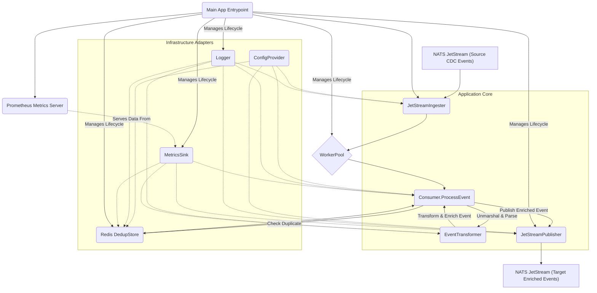
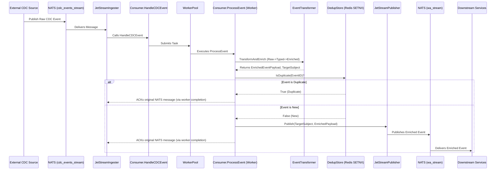

# Daisi CDC Consumer Service

## 1. Overview

`daisi-cdc-consumer-service` is a **stateless Golang micro-service** that:

1.  **Ingests** Sequin CDC messages published to JetStream subjects `cdc.<company>.<table>`.
2.  **Processes *only* the tables `messages`, `chats`, and `agents`** – all other tables are acknowledged and ignored.
3.  **Normalises & enriches** the payload with `agent_id`, `chat_id`, and related metadata.
4.  **Publishes** compact JSON events to subjects consumed by `daisi-ws-service`, e.g. `wa.<company>.<agent>.messages.<chat_id>`.

The pipeline is single-deployment, horizontally scalable, and targets **≤ 200 ms P95** end-to-end latency (Sequin → Browser). It is designed to be configurable via a `config.yaml` file and environment variables, leveraging dependency injection using Google Wire for managing its components.

## 2. Core Functional Requirements

| #   | Feature                               | What it does                                           | How it works                                                                                              |
| --- | ------------------------------------- | ------------------------------------------------------ | --------------------------------------------------------------------------------------------------------- |
| F-1 | **Schema-agnostic ingestion**         | Consume every tenant schema without redeploy.          | Durable **push** consumer on `cdc.*.*` (stream `cdc_events_stream`) with queue group `cdc_consumers`.     |
| F-2 | **Table filter**                      | Process only `messages`, `chats`, and `agents` tables. | If `table ∉ {messages,chats,agents}` → `Ack()` immediately, skip transform and publish.                   |
| F-3 | **Transform & subject mapping**       | Build subject `wa.<C>.<A>.<logical>[.<chat_id>]`.      | Extract company from subject, read `agent_id` & `chat_id` from row image, map logical stream.             |
| F-4 | **Idempotent publish (exactly-once)** | Prevent duplicates even on redelivery.                 | `event_id = LSN:table:PK`; `SETNX dedup:{event_id} "" EX 300` in Redis before `PublishMsgSync`.           |
| F-5 | **Back-pressure & retry**             | Preserve order and survive broker hiccups.             | On publish error → **do not Ack**. JetStream redelivers after `AckWait` (30 s) with max redeliveries = 3. |
| F-6 | **Observability**                     | Provide SLO dashboards and structured logs.            | Prometheus counters / histograms, Zap JSON logs, `/metrics` endpoint.                                     |
| F-7 | **Benchmark harness**                 | Demonstrate ≥ 5 k msg / s per replica.                 | `go test -bench` with **in-process mocks for JetStream & Redis** (no Docker).                             |

## 3. System Architecture

### 3.1. High-level Overview

The Daisi CDC Consumer Service's primary functions include:

*   **Ingesting CDC Events:** Subscribing to a NATS JetStream topic where raw CDC events (presumably from a database via a tool like Sequin) are published.
*   **Event Transformation & Enrichment:** Parsing raw events, transforming them into strongly-typed structures, and enriching them with additional metadata like a unique `EventID` and routing information.
*   **Deduplication:** Ensuring that events are processed only once using a Redis-based deduplication store.
*   **Publishing Enriched Events:** Forwarding the processed and enriched events to a designated NATS JetStream topic for other services.
*   **Monitoring & Observability:** Providing metrics via Prometheus and structured logging via Zap.
*   **Resilience:** Employing a worker pool for concurrent event processing and a panic guard mechanism to prevent cascading failures.

### 3.2. Core Components and Interactions

The system is modular, with distinct components for different responsibilities:



*(For a detailed component breakdown, see `docs/system_architecture.md#2-core-components-and-interactions`)*

### 3.3. Data Flow Diagram


*(For more details on Data Flow, Key Design Decisions, and System Constraints, refer to `docs/system_architecture.md`)*

## 4. Published Schemas and NATS Subjects

### 4.1. Published JSON Schema (`EnrichedEventPayload`)

The service publishes messages with the following JSON structure, derived from the `EnrichedEventPayload` Go struct.

```json
{
  "type": "object",
  "properties": {
    "event_id": {
      "type": "string",
      "description": "Unique identifier for the event, typically in the format LSN:TableName:PK. Example: '1632321:messages:msg-789'"
    },
    "company_id": {
      "type": "string",
      "description": "The company ID associated with the event. This is a mandatory field."
    },
    "agent_id": {
      "type": "string",
      "description": "The agent ID associated with the event. Present if applicable, otherwise empty. Mandatory for routing."
    },
    "message_id": {
      "type": "string",
      "description": "The message ID, primarily for events originating from the 'messages' table. Present if applicable, otherwise empty."
    },
    "chat_id": {
      "type": "string",
      "description": "The chat ID, relevant for events from 'messages' and 'chats' tables. Present if applicable, otherwise empty."
    },
    "row_data": {
      "type": "object",
      "description": "Contains the actual data from the table's row involved in the CDC event. The structure of this object depends on the source table ('messages', 'chats', or 'agents').",
      "additionalProperties": true
    }
  },
  "required": [
    "event_id",
    "company_id",
    "row_data"
  ]
}
```
*(For example payloads and `RowData` structure details, see `docs/schemas.md`)*

### 4.2. NATS Publish Subject Patterns

The service publishes enriched events to a NATS JetStream named **`wa_stream`**.

*   **For `messages` table events:**
    *   Pattern: `wa.<company_id>.<agent_id>.messages.<chat_id>`
    *   Example: `wa.company_xyz.agent_123.messages.chat_abc`
*   **For `chats` table events:**
    *   Pattern: `wa.<company_id>.<agent_id>.chats`
    *   Example: `wa.company_xyz.agent_123.chats`
*   **For `agents` table events:**
    *   Pattern: `wa.<company_id>.<agent_id>.agents`
    *   Example: `wa.company_xyz.agent_123.agents`

*(For more details, see `docs/schemas.md`)*

## 5. Developer Guide

### 5.1. Setup Instructions

#### Prerequisites
*   **Go:** Version 1.23 or higher
*   **Docker & Docker Compose**
*   **Make**
*   **Git**

#### Initial Setup
1.  **Clone Repository:** `git clone <repository_url> && cd daisi-cdc-consumer-service`
2.  **Configuration:** `cp .env.example .env` (and update if needed). Main config is `config.yaml`.
3.  **Go Dependencies:** `go mod tidy && go mod download`
4.  **Start Dependent Services:** `make up` (starts NATS & Redis via Docker Compose).

#### Running the Application
*   **Locally:** `go run cmd/daisi-cdc-consumer-service/main.go`
*   **Using Docker:** `make build` then `docker-compose up cdc-consumer` (or via `make up`).

#### Useful Makefile Commands
*   `make build`: Builds the Docker image.
*   `make up`/`make down`: Starts/stops Docker Compose services.
*   `make logs`: Tails application logs.
*   `make test`: Runs unit and integration tests.
*   `make bench`: Runs Go benchmarks.
*   `make lint`: Runs `golangci-lint`.

*(For a detailed project structure overview, development workflow, testing approach, and troubleshooting, please refer to `docs/developer_guide.md`)*

## 6. Key Technical Details

| Layer                | Technology / Setting                                                         |
| -------------------- | ---------------------------------------------------------------------------- |
| **Language & Build** | Go 1.23, `CGO_ENABLED=0`, multi-stage Docker (bookworm-slim)                 |
| **Broker**           | NATS JetStream (Streams: `cdc_events_stream`, `wa_stream`)                   |
| **Ingestion**        | `QueueSubscribe`, `AckPolicy=explicit`, `AckWait=30s`, `MaxAckPending=5000` |
| **Worker Pool**      | `panjf2000/ants`, size `GOMAXPROCS()*4` (configurable)                       |
| **Dedup cache**      | Redis 7 single-shard, `maxmemory 100 Mi`, `allkeys-lru`, 5-min TTL           |
| **Transform lib**    | `jsoniter`                                                                   |
| **Config**           | Viper (ENV > YAML)                                                           |
| **Observability**    | Prometheus metrics, Zap structured logs                                      |

*(For more detailed technical architecture, non-functional requirements, and other appendices, refer to the full Product Requirements Document at `docs/new-prd-daisi-cdc-consumer-service.md` and the Technical Architecture section within it.)*

## 7. Further Documentation

For more in-depth information, please see the following documents in the `/docs` directory:

*   [`system_architecture.md`](docs/system_architecture.md): Detailed breakdown of components, interactions, design decisions, and constraints.
*   [`developer_guide.md`](docs/developer_guide.md): Comprehensive guide for developers, including setup, workflow, testing, and troubleshooting.
*   [`schemas.md`](docs/schemas.md): Detailed JSON schemas for published events and NATS subject patterns.

The full Product Requirements Document (PRD) and Technical Requirements & Architecture document can be found at:
* [`docs/new-prd-daisi-cdc-consumer-service.md`](docs/new-prd-daisi-cdc-consumer-service.md)

---
This README aims to provide a comprehensive entry point to the `daisi-cdc-consumer-service` project.
