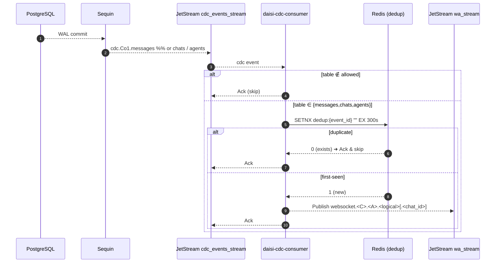
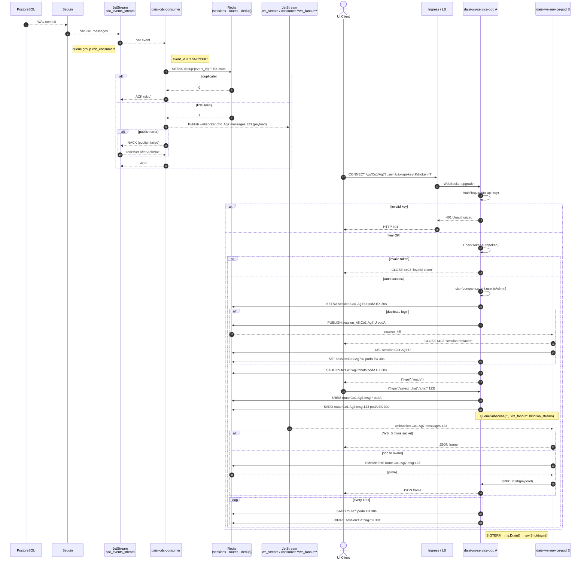
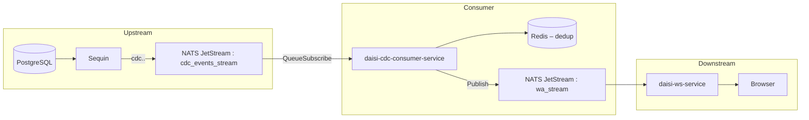
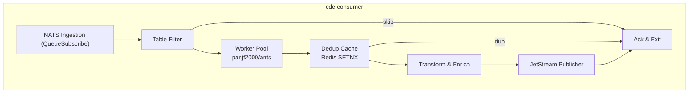

# Product Requirements Document – **daisi-cdc-consumer-service**

*Document owner:* @prasetyo.pandu
*Last updated:* 16 May 2025

---

## 1 . Overview

`daisi-cdc-consumer-service` is a **stateless Golang micro-service** that:

1. **Ingests** Sequin CDC messages published to JetStream subjects `cdc.<company>.<table>`.
2. **Processes *only* the tables `messages`, `chats`, and `agents`** – all other tables are acknowledged and ignored.
3. **Normalises & enriches** the payload with `agent_id`, `chat_id`, and related metadata.
4. **Publishes** compact JSON events to subjects consumed by `daisi-ws-service`, e.g.
   `websocket.<company>.<agent>.messages.<chat_id>`.

The pipeline is single-deployment, horizontally scalable, and targets **≤ 200 ms P95** end-to-end latency (Sequin → Browser).

---

## 2 . Core Functional Requirements

| #   | Feature                               | What it does                                           | How it works                                                                                              |
| --- | ------------------------------------- | ------------------------------------------------------ | --------------------------------------------------------------------------------------------------------- |
| F-1 | **Schema-agnostic ingestion**         | Consume every tenant schema without redeploy.          | Durable **push** consumer on `cdc.*.*` (stream `cdc_events_stream`) with queue group `cdc_consumers`.     |
| F-2 | **Table filter**                      | Process only `messages`, `chats`, and `agents` tables. | If `table ∉ {messages,chats,agents}` → `Ack()` immediately, skip transform and publish.                   |
| F-3 | **Transform & subject mapping**       | Build subject `websocket.<C>.<A>.<logical>[.<chat_id>]`.      | Extract company from subject, read `agent_id` & `chat_id` from row image, map logical stream.             |
| F-4 | **Idempotent publish (exactly-once)** | Prevent duplicates even on redelivery.                 | `event_id = LSN:table:PK`; `SETNX dedup:{event_id} "" EX 300` in Redis before `PublishMsgSync`.           |
| F-5 | **Back-pressure & retry**             | Preserve order and survive broker hiccups.             | On publish error → **do not Ack**. JetStream redelivers after `AckWait` (30 s) with max redeliveries = 3. |
| F-6 | **Observability**                     | Provide SLO dashboards and structured logs.            | Prometheus counters / histograms, Zap JSON logs, `/metrics` endpoint.                                     |
| F-7 | **Benchmark harness**                 | Demonstrate ≥ 5 k msg / s per replica.                 | `go test -bench` with **in-process mocks for JetStream & Redis** (no Docker).

---

## 3 . Subject Conventions

| Logical stream | Published subject                         | Notes                                                    |
| -------------- | ----------------------------------------- | -------------------------------------------------------- |
| **Chat list**  | `websocket.<company>.<agent>.chats`              | One message per row in `chats`                           |
| **Message**    | `websocket.<company>.<agent>.messages.<chat_id>` | `<chat_id>` path segment enables per-thread subscription |
| **Agent**      | `websocket.<company>.<agent>.agents`             | Agent profile updates                                    |

> **Why** – `daisi-ws-service` subscribes exactly to these patterns, removing the need for payload inspection on the WebSocket layer.
> > **Note** – Internal Redis route keys use shorthand `msg` (e.g. `route:<company>:<agent>:msg:<chat_id>`) while subjects always spell out `messages`

---

## 4 . Data Flow

### 4.1 Sequence diagram



### 4.2 Filtering logic (pseudo-code)

```go
allowed := map[string]struct{}{
    "messages": {},
    "chats":    {},
    "agents":   {},
}
table := extractTableName(msg.Subject)
if _, ok := allowed[table]; !ok {
    _ = msg.Ack()  // fast-path acknowledge
    return
}
```

---

## 5 . Technical Architecture

| Layer                | Technology / Setting                                                         | Notes                                     |
| -------------------- | ---------------------------------------------------------------------------- | ----------------------------------------- |
| **Language & Build** | Go 1.23, `CGO_ENABLED=0`, multi-stage Docker (bookworm-slim)                 | –                                         |
| **Broker**           | NATS JetStream                                                               | Streams: `cdc_events_stream`, `wa_stream` |
| **Ingestion**        | `QueueSubscribe`, `AckPolicy=explicit`, `AckWait=30s`, `MaxAckPending=5 000` | Queue group `cdc_consumers`               |
| **Worker Pool**      | `panjf2000/ants`, size `GOMAXPROCS()*4`                                      | Isolates slow transforms                  |
| **Dedup cache**      | Redis 7 single-shard, `maxmemory 100 Mi`, `allkeys-lru`                      | 5-minute TTL per event                    |
| **Transform lib**    | `jsoniter`                                                                   | Protobuf toggle planned                   |
| **Config**           | Viper (ENV > YAML), hot reload on SIGHUP                                     | –                                         |
| **Observability**    | Prometheus metrics, Zap structured logs                                      | See §9.1                                  |
| **Deployment**       | Helm chart; HPA on CPU + `cdc_consumer_lag_seconds`                          | Liveness - rolling success counter        |

---

## 6 . Non-functional Requirements

| Aspect            | Target                         |
| ----------------- | ------------------------------ |
| Latency (P95)     | ≤ 60 ms ingest → publish       |
| Throughput        | ≥ 5 000 events / s per replica |
| Availability      | ≥ 99.9 % over 30 days          |
| Crash-loop budget | ≤ 3 pod restarts per day       |

---

## 7 . Development Roadmap

| Phase                | Deliverables                                                       |
| -------------------- |--------------------------------------------------------------------|
| **P-0 Infra**        | Local docker compose for Nats, sequin, redis. sequin configuration |
| **P-1 MVP**          | Filtered ingestion (messages, chats, agents) + metrics + Grafana   |
| **P-2 Resilience**   | Redis dedup, back-off, panic after 15 min cumulative failures      |
| **P-3 Performance**  | Load-test 10 k msg / s, GC tuning, Pool sizing                     |
| **P-4 Enhancements** | Protobuf toggle, per-tenant rate limit, dynamic schema discovery   |

---

## 8 . Risks & Mitigations

| Risk                           | Impact                          | Mitigation                                           |
| ------------------------------ | ------------------------------- | ---------------------------------------------------- |
| **Missing table in filter**    | Legit events silently dropped   | Unit test table list, alert on `unknown_table_total` |
| **Redis eviction under burst** | Duplicate WS pushes             | 5-minute TTL, monitor `redis_evicted_keys_total`     |
| **Subject drift**              | Events never reach WebSocket UI | Shared constants module, CI contract tests           |

---

## 9 . Appendix

### 9.1 Custom Prometheus Metrics

| Metric name                         | Type      | Labels                                          |
| ----------------------------------- | --------- | ----------------------------------------------- |
| `cdc_consumer_events_total`         | Counter   | `table`, `result`=processed\|skipped\|duplicate |
| `cdc_consumer_publish_errors_total` | Counter   | –                                               |
| `cdc_consumer_processing_seconds`   | Histogram | `table`                                         |
| `cdc_consumer_redis_hit_total`      | Counter   | `hit` / `miss`                                  |
| `cdc_consumer_lag_seconds`          | Gauge     | –                                               |

### 9.2 Processing skeleton

```go
Pool, _ := ants.NewPool(runtime.GOMAXPROCS(0) * 4)

js.QueueSubscribe("cdc.*.*", "cdc_consumers",
    func(m *nats.Msg) { _ = Pool.Submit(func() { handle(m) }) },
    nats.ManualAck(),
    nats.AckWait(30*time.Second),
    nats.MaxAckPending(5000),
)
```

---

### 10 . Out of Scope – and *why*

| Item (explicitly **not** delivered in this PRD)                                  | Why it is deferred / excluded                                                                                                                                                                                                                                            |
| -------------------------------------------------------------------------------- | ------------------------------------------------------------------------------------------------------------------------------------------------------------------------------------------------------------------------------------------------------------------------ |
| **CI / CD pipeline definitions** (GitHub Actions, GitLab CI, etc.)               | Infrastructure automation lives in a shared central repository. Bundling it here would blur ownership and slow the MVP. A lightweight `docker build && go test` is enough for local dev; the platform-eng team will stitch the job into the org-standard pipeline later. |
| **Helm charts & Kubernetes deployment manifests**                                | The consumer's container-image contract (`latest → semver tag`, env-vars) is all this doc needs. Packaging and rollout strategy (HPA, service mesh, PodDisruptionBudget) are environment-specific and belong to the deployment cookbook maintained by SRE.               |
| Cluster-wide **observability plumbing** (Grafana dashboards, Alertmanager rules) | The Prometheus metrics (§ 9.1) are provided; wiring them into dashboards and alerts is a separate SLO task handled at the platform layer.                                                                                                                                |
| **Data-warehouse ETL** or long-term CDC archival                                 | This service's charter ends once the event hits `wa_stream`. Down-stream analytics ingest will be defined in its own PRD to avoid tighter coupling.                                                                                                                      |
| **Redis HA / multi-AZ replication design**                                       | We assume a managed Redis with the stated eviction policy; HA topology choices vary by environment (dev ≠ prod).                                                                                                                                                         |
| **Tenant API-key issuance & rotation flows**                                     | Credential lifecycle is an auth-service concern; here we only validate the supplied key.                                                                                                                                                                                 |
| **Browser-side WebSocket protocol details**                                      | Handled in `daisi-ws-service` PRD. This document only guarantees subject schema and payload shape.                                                                                                                                                                       |

---

### 11. Combined sequence diagram with `daisi-ws-service`


---

**End of PRD document**


# Technical Requirements & Architecture – **daisi-cdc-consumer-service**

*Document owner: @prasetyo.pandu*  
*Last updated: 16 May 2025*

---

## 1. Purpose & Scope

This document translates the high-level Product Requirements Document (PRD) for **daisi-cdc-consumer-service** into concrete, implementation-ready technical requirements and an actionable architecture blueprint. It also clarifies system context with:

* **daisi-ws-service** – the downstream WebSocket broadcaster ([PRD](./new-prd-daisi-ws-service.md)).
* **message-event-service** – the upstream event processor whose PostgreSQL schema is defined in [`schema.md`](./schema.md).

> **Goal** – deliver a horizontally-scalable, exactly-once CDC consumer that converts Sequin CDC events into compact JetStream subjects used by the WebSocket tier, maintaining ≤ 60 ms P95 ingest → publish latency and ≥ 5 000 events/s per replica.

---

## 2. Functional Requirements (Derived)

| Ref | Requirement | Acceptance Criteria |
|-----|-------------|---------------------|
| **FR-1** | *Schema-agnostic ingestion* | The service consumes **all** JetStream subjects matching `cdc.*.*` without prior schema knowledge. A new tenant or table shall not require code changes or redeploys. |
| **FR-2** | *Table filter* | Messages whose `table` ∉ `{messages, chats, agents}` are acknowledged immediately (< 5 ms) and never published downstream. |
| **FR-3** | *Transform & mapping* | For allowed tables, the service publishes **one** JSON event to `websocket.<company>.<agent>.<logical>[.<chat_id>]` with required metadata fields (`agent_id`, `chat_id`, etc.). |
| **FR-4** | *Idempotent publish* | Duplicate CDC events **never** result in duplicate downstream events. Redis `SETNX` guard + event_id (`LSN:table:PK`) ensures exactly-once semantics within a 5-minute window. |
| **FR-5** | *Back-pressure & retry* | On publish error the message is **not** acknowledged → JetStream redelivers after `AckWait=30 s`, max 3 redeliveries. Order is preserved. |
| **FR-6** | *Observability* | Prometheus metrics (§ 9) are emitted; `/metrics` endpoint is exposed. Zap JSON logs include `trace_id`, `company`, `table`, `event_id`, `latency_ms`. |
| **FR-7** | *Benchmark harness* | `go test -bench` demonstrates ≥ 5 k events/s per replica **using in-process mocks for JetStream & Redis (no external containers)**. |

### Deferred / Out-of-Scope (from PRD § 10)
CI/CD pipelines, Helm charts, long-term CDC archival, Redis HA topology – owned by other repositories.

---

## 3. Non-functional Requirements

| Aspect | Target | Notes |
|--------|--------|-------|
| **Latency (P95)** | ≤ 60 ms ingest → publish | Budget for parsing, transform, Redis hit, and JetStream publish. |
| **Throughput** | ≥ 5 000 events/s/replica | Sustained for 10 min load test, messages evenly distributed. |
| **Availability** | ≥ 99.9 % / 30 days | No single point of failure; pod restarts < 3/day. |
| **Resource limits** | CPU ≤ 1 vCPU, Mem ≤ 512 MiB (steady-state) | Burst is allowed during spikes. |
| **Security** | Network encryption in-cluster (mTLS) where supported; Redis auth enabled. |
| **Scalability** | Linear horizontal scaling; HPA on CPU + custom lag metric. |
| **Observability** | Grafana dashboards & alerts for all custom metrics and Redis eviction. |

---

## 4. System Context



### Integration Points

| Direction | Protocol | Subject / Channel | Notes |
|-----------|----------|-------------------|-------|
| Inbound ← | NATS JetStream Push | `cdc.*.*` | Durable consumer `cdc_consumers`. |
| Dedup ↔︎ | Redis `SETNX` | `dedup:{event_id}` | TTL = 300 s; single-shard LRU. |
| Outbound → | NATS JetStream Pub | `websocket.<C>.<A>.<logical>[.<chat_id>]` | Stream `wa_stream` (push). |
| Metrics → | HTTP + Prometheus | `/metrics` | Scraped by Prometheus. |

---

## 5. Architecture Overview

### 5.1 Component Diagram



### 5.2 Layer–Module Mapping (aligned with 5.3)

| Clean-Arch Layer | Package Path | Responsibility | Key Tech |
|------------------|--------------|----------------|----------|
| **Domain** | `internal/domain` | Event & subject models, validation helpers, and **port** interfaces (`DedupStore`, `Publisher`, `MetricsSink`). | stdlib only |
| **Application** | `internal/application` | High-level use-cases (e.g. `Consumer.HandleMsg`), orchestrating domain + ports, plus central `worker_pool`. | `panjf2000/ants` |
| **Adapters – Ingress** | `internal/adapters/nats/ingest` | JetStream `QueueSubscribe`, manual acks, back-pressure handling; calls Application layer. | `nats.go / jetstream` |
| **Adapters – Egress** | `internal/adapters/nats/publish` | Publishes transformed events to `wa_stream`; implements `domain.Publisher`. | `nats.go` |
| **Adapters – Dedup** | `internal/adapters/redis` | Redis `SETNX/EX` wrapper providing `DedupStore`. | `go-redis/redis/v9` |
| **Adapters – Metrics** | `internal/adapters/metrics` | Prometheus collectors & `/metrics` HTTP handler; implements `MetricsSink`. | `prometheus/client_golang` |
| **Adapters – Config** | `internal/adapters/config` | Viper-based ENV/YAML loader + hot reload. | `spf13/viper` |
| **Adapters – Logger** | `internal/adapters/logger` | Structured Zap logger with trace id, hooks. | `uber-go/zap` |
| **Bootstrap** | `internal/bootstrap` | Dependency wiring & lifecycle (compile-time DI). | `google/wire` |


### 5.3 Code Architecture & Package Layout

To balance **maintainability** with **high-throughput performance**, adopt a _Clean / Hexagonal_ architecture that clearly separates **pure business rules** from **infrastructure concerns** while keeping the hot path free of reflection and unnecessary allocations.

```
daisi-cdc-consumer-service/
├── cmd/
│   └── daisi-cdc-consumer-service/
│       └── main.go          // wire dependencies & start modules
├── internal/
│   ├── domain/              // ✅ Pure, testable business types & ports
│   │   ├── model.go         // EventID, AllowedTables, Subject parts…
│   │   └── ports.go         // Interfaces (DedupStore, Publisher, Metrics)…
│   ├── application/         // ✅ Use-cases orchestrating domain + ports
│   │   ├── consumer.go      // HandleMsg(use ports.DedupStore, Publisher…)
│   │   └── worker_pool.go   // Thin wrapper on ants Pool
│   ├── adapters/            // ❌ No domain import backwards
│   │   ├── nats/
│   │   │   ├── ingest.go    // QueueSubscribe → application.Consumer
│   │   │   └── publish.go   // Implements domain.Publisher
│   │   ├── redis/
│   │   │   └── dedup.go     // Implements domain.DedupStore
│   │   ├── metrics/
│   │   │   └── prometheus.go
│   │   ├── config/
│   │   │   └── viper.go
│   │   └── logger/
│   │       └── zap.go
│   └── bootstrap/           // Dependency wiring (fx / wire)
│       └── container.go
└── pkg/                      // Optional reusable helpers (jsoniter, utils …)
```

Key rules:
1. **Domain & application layers** MUST NOT import `nats`, `redis`, or any 3rd-party packages – promotes easy unit testing and future tech swaps.
2. **Adapters** depend _outwards_ on domain ports, never the reverse (dependency inversion).
3. Concurrency handled centrally in `application/worker_pool.go`; message handler remains single-purpose and deterministic.
4. Initialization & lifecycle are orchestrated in `bootstrap/container.go` using **Uber Fx** (fast reflection-free DI) _or_ Google Wire (compile-time), ensuring explicit dependency graphs.
5. Hot code paths avoid allocations:
   * Pre-allocate subject strings with `strings.Builder` & capacity hints.
   * Use `jsoniter.ConfigFastest` with registered struct encoders.
   * Re-use `nats.Msg` buffers when possible (`msg.Data` slice not copied).
6. Cross-cutting concerns (logging, metrics, tracing) injected via context; domain logic only surfaces structured events.

> **Benefit** – engineers can change Redis for a different KV store or JetStream for Kafka by creating new adapter implementations without touching core logic.

---

## 6. Data Model & Mapping

### 6.1 CDC Event → Downstream Payload

| Source Column (Sequin) | Downstream Field | Notes |
|-----------------------|------------------|-------|
| `lsn` + `table` + `pk` | `event_id` | Used for dedup (`LSN:table:PK`). |
| `row.agent_id` | `<agent>` segment & payload field | Assumes column exists in all three tables. |
| `row.chat_id` | `<chat_id>` segment (messages) | Only for `messages` stream. |
| Entire row image | `payload` | Compact JSON – **no** inner WAL metadata. |

### 6.2 Interaction with Upstream Postgres Schema
The consumer **does not** write to Postgres, but understanding message semantics aids transform logic. Table definitions from [`schema.md`](./message-event-service-docs/schema.md) inform field extraction and validation.

---

## 7. Deployment & Infrastructure

| Container | Base | CMD | Ports |
|-----------|------|-----|-------|
| `daisi-cdc-consumer` | `golang:1.23-bookworm` (multi-stage → `bookworm-slim`) | `/app/daisi-cdc-consumer-service` | `8080/tcp` (`/metrics`) |

### Runtime Environment Variables

| Var | Default | Description |
|-----|---------|-------------|
| `NATS_URL` | `nats://nats:4222` | JetStream broker. |
| `REDIS_ADDRESS` | `redis:6379` | Dedup cache. |
| `DEDUP_TTL` | `300s` | Redis key expiry. |
| `JS_ACK_WAIT` | `30s` | Ack wait duration. |
| `JS_MAX_DELIVER` | `3` | Max redeliveries. |
| `WORKERS` | `GOMAXPROCS()*4` | Pool size override. |
| `LOG_LEVEL` | `info` | Zap level. |

### Kubernetes

* **HPA**: CPU ≥ 70 % **or** `cdc_consumer_lag_seconds > 3` for 1 min.
* **Liveness**: consecutive success counter; fails if no ACK for 2 min.
* **Readiness**: JetStream connection + Redis ping + `metrics OK`.

---

## 8. Error Handling & Resilience

1. **Dedup Key Eviction** – Monitor `redis_evicted_keys_total`; fallback path logs a warning but still publishes (risk: duplicates).
2. **Publish Failure** – Any error from `PublishMsgSync` → NACK → rely on JetStream redelivery; add exponential delay based on delivery attempt.
3. **Panic Guard** – Cumulative consecutive failures > 15 min triggers `log.Fatal` ➜ pod restart (Phase P-2).
4. **DLQ** – If JetStream exhausts retries, DLQ worker (separate deployment) processes messages following [`DLQPayload`](./message-event-service-docs/schema.md#dlq-schema).

---

## 9. Observability Specification

### 9.1 Custom Prometheus Metrics

| Metric | Type | Labels | Description |
|--------|------|--------|-------------|
| `cdc_consumer_events_total` | Counter | `table`, `result` = processed\|skipped\|duplicate | Ingestion outcomes. |
| `cdc_consumer_processing_seconds` | Histogram | `table` | End-to-end processing latency. |
| `cdc_consumer_publish_errors_total` | Counter | – | JetStream publish failures. |
| `cdc_consumer_lag_seconds` | Gauge | – | Max JetStream delivered→ack latency per replica. |
| `cdc_consumer_redis_hit_total` | Counter | `hit`\|`miss` | Dedup cache efficiency. |

### 9.2 Log Fields
`time`, `level`, `msg`, `trace_id`, `event_id`, `company`, `table`, `latency_ms`, `redis_hit`, `delivery_attempt`.

---

## 10. Security Considerations

* **Data-in-motion**: NATS & Redis connections use TLS when certificates are provided; otherwise fall back to plaintext in dev.
* **Principle of Least Privilege**: NATS credentials limited to `cdc_events_stream` and `wa_stream` publish.
* **Secrets**: Passed via Kubernetes `Secret` objects mounted as ENV.
* **Input Validation**: Strict JSON schema + struct validation; reject unexpected fields.

---

## 11. Testing & Benchmarking

| Layer | Strategy | Tools |
|-------|----------|-------|
| Unit | Table-driven tests for transform & subject mapping. | `testing`, `testify` |
| Integration | Spin-up NATS, Redis, Postgres + Sequin via **testcontainers-go**; assert dedup, retries. | `testcontainers-go` |
| Benchmark | `go test -bench . -run ^$` **with mock JetStream & Redis**; target ≥ 5 k events/s. | Go benchmark harness |
| Load | k6 script publishing to NATS to validate HPA scaling. | `k6`, `grafana/k6` |

### 11.1 Unit Tests
* Table-driven tests covering domain validation, subject construction, and transform logic.
* Use **Go 1.23 fuzzing** for edge-case discovery on subject builder and JSON transform.

### 11.2 Integration Tests (preferred: **testcontainers-go**)
* Spin up disposable NATS, Redis, and Sequin-backed Postgres using the Testcontainers-Go API.
* Example snippet:
```go
redisC, _ := testcontainers.GenericContainer(ctx,
    testcontainers.GenericContainerRequest{
        ContainerRequest: testcontainers.ContainerRequest{
            Image:        "redis:7-alpine",
            ExposedPorts: []string{"6379/tcp"},
            WaitingFor:   wait.ForListeningPort("6379/tcp"),
        },
        Started: true,
    })
```
* Publish synthetic CDC messages → assert:
  1. Correct downstream subject.
  2. Redis dedup key set.
  3. JetStream ACK/NACK behaviour on error simulation.

### 11.3 Contract Tests
* Maintain a golden-file directory with sample CDC → expected WS event JSON.
* Run in CI with `go test ./contracts/...` to detect breaking changes in mapping.

### 11.4 Benchmark Harness
* `go test -bench . -run ^$ ./bench` executes pipeline with **mock publisher, consumer, and in-memory Redis stub** (no Docker). Provides deterministic throughput numbers unaffected by network I/O.
* Targets: ≥ 5 000 events/s with 4×CPU ants Pool, ≤ 60 ms P95 processing.

### 11.5 Chaos
* Toxiproxy container to simulate Redis outage → verify duplicate handling.

### 11.6 Local Developer Workflow
* **docker-compose.yaml** with NATS, Redis, Postgres+Sequin mirrors container images/versions used in tests.
* Make targets:
  * `make dev` – spin docker-compose + run service with live reload.
  * `make test` – execute unit + integration tests.
  * `make bench` – run benchmark harness.

---

## 12. Roadmap Alignment

Architecture paths align with PRD roadmap phases P-0 → P-4. The design is extensible for future enhancements (protobuf toggle, per-tenant rate limit) without breaking core pipeline.


---

**End of Technical Requirements & Architecture document**