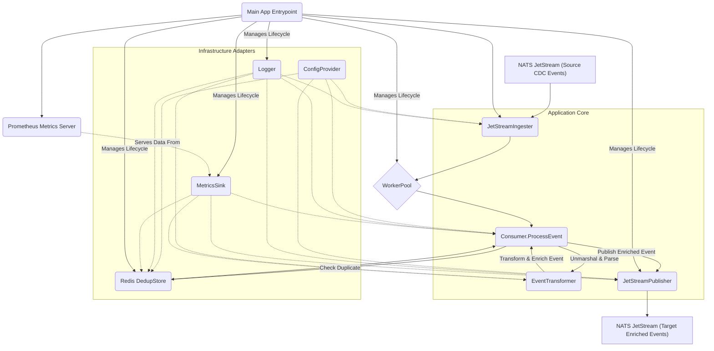
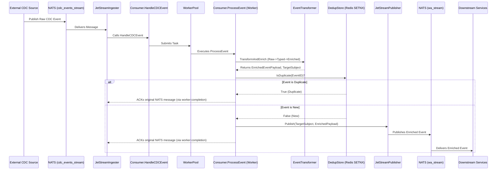

# System Architecture: Daisi CDC Consumer Service

## 1. High-level Overview

The Daisi CDC Consumer Service is a Go application designed to consume Change Data Capture (CDC) events from a NATS JetStream, process these events, and then publish enriched versions to another NATS JetStream for downstream consumers. Its primary functions include:

*   **Ingesting CDC Events:** Subscribing to a NATS JetStream topic where raw CDC events (presumably from a database via a tool like Sequin) are published.
*   **Event Transformation & Enrichment:** Parsing raw events, transforming them into strongly-typed structures, and enriching them with additional metadata like a unique `EventID` and routing information.
*   **Deduplication:** Ensuring that events are processed only once using a Redis-based deduplication store.
*   **Publishing Enriched Events:** Forwarding the processed and enriched events to a designated NATS JetStream topic for other services.
*   **Monitoring & Observability:** Providing metrics via Prometheus and structured logging via Zap.
*   **Resilience:** Employing a worker pool for concurrent event processing and a panic guard mechanism to prevent cascading failures.

The service is designed to be configurable via a `config.yaml` file and environment variables. It leverages dependency injection using Google Wire for managing its components.

## 2. Core Components and Interactions

The system is modular, with distinct components for different responsibilities:

**Component Breakdown:**

*   **`main.go` (Application Entrypoint):**
    *   Initializes the application using `bootstrap.InitializeApp()`.
    *   Starts the `JetStreamIngester`.
    *   Manages graceful shutdown.

*   **`bootstrap` (Dependency Injection & Initialization):**
    *   Uses Google Wire (`wire_gen.go`) to assemble the application graph.
    *   `InitializeApp()`: Constructs and returns the `App` struct, which holds instances of all major components (Logger, ConfigProvider, NATS Connection, Redis Client, Metrics Sink, Ingester, Publisher, Consumer, WorkerPool, etc.).
    *   Manages the lifecycle (creation and cleanup) of these components.

*   **`ConfigProvider` (`adapters/config/viper.go`):**
    *   Uses Viper to load configuration from `config.yaml` and environment variables (prefixed `DAISI_CDC_`).
    *   Provides access to configuration values throughout the application.

*   **`Logger` (`adapters/logger/zap.go`):**
    *   Uses Zap for structured, leveled logging.
    *   Supports adding contextual information (e.g., `event_id`, `table_name`) to log messages.

*   **`JetStreamIngester` (`adapters/nats/ingest.go`):**
    *   Subscribes to the source NATS JetStream (e.g., `cdc_events_stream`) for raw CDC events.
    *   Uses a durable consumer group (e.g., `cdc_consumers`).
    *   For each received NATS message, it wraps it in a `CDCEventMessage` and passes it to `Consumer.HandleCDCEvent()`.
    *   Responsible for creating the NATS stream and consumer if they don't exist, based on configuration.

*   **`WorkerPool` (`application/worker_pool.go`):**
    *   Manages a pool of goroutines (using `panjf2000/ants/v2`) to process events concurrently.
    *   The `Consumer` submits event processing tasks (`Consumer.ProcessEvent`) to this pool.
    *   Pool size is configurable and defaults based on `GOMAXPROCS`.

*   **`Consumer` (`application/consumer.go`):**
    *   `HandleCDCEvent()`: The initial handler for messages from `JetStreamIngester`.
        *   Parses the NATS subject to extract metadata (table name, action).
        *   Validates if the table is allowed for processing (via `domain.AllowedTables`).
        *   If allowed, submits the `ProcessEvent` task to the `WorkerPool`. Otherwise, ACKs and skips.
    *   `ProcessEvent()`: The core event processing logic, executed by a worker goroutine.
        *   Unmarshals the raw JSON data into `domain.CDCEventData`.
        *   Calls `EventTransformer.TransformAndEnrich()` to get the processed payload and target NATS subject.
        *   Uses `DedupStore.IsDuplicate()` to check if the event (based on its derived `EventID`) has been processed before.
        *   If not a duplicate, calls `Publisher.Publish()` to send the enriched event.
        *   ACKs the original NATS message on successful processing or if it's a known duplicate/skippable event. NACKs on processing errors to allow for retries by NATS.
        *   Implements a "panic guard" mechanism to trigger a controlled shutdown if a high number of consecutive processing failures occur.

*   **`EventTransformer` (`application/transform_service.go`):**
    *   `TransformAndEnrich()`:
        *   Takes raw `CDCEventData` and determines the authoritative table name.
        *   Maps the `Record` (a `map[string]interface{}`) into strongly-typed structs (`domain.AgentData`, `domain.ChatData`, `domain.MessageData`).
        *   Identifies any fields present in the raw record but not defined in the typed struct ("unhandled fields") and logs them.
        *   Constructs a unique `EventID` (format: `LSN:TableName:PK_Value`).
        *   Extracts key identifiers (`company_id`, `agent_id`, `chat_id`, `message_id`) to build `domain.EnrichedEventPayload`.
        *   Determines the target NATS subject for publishing (e.g., `wa.<company_id>.<agent_id>.messages.<chat_id>`).
        *   Marshals the `EnrichedEventPayload` into JSON bytes for publishing.

*   **`DedupStore` (`adapters/redis/dedup.go`):**
    *   Connects to a Redis instance.
    *   `IsDuplicate()`: Uses Redis `SETNX` command with a Time-To-Live (TTL) to check for and mark events as processed. The key is typically `dedup:<EventID>`.

*   **`JetStreamPublisher` (`adapters/nats/publish.go`):**
    *   Publishes the JSON-marshaled `EnrichedEventPayload` to the target NATS JetStream (e.g., `wa_stream`).
    *   Ensures the target NATS stream exists, creating it if necessary based on configuration.

*   **`MetricsSink` & `MetricsServer` (`adapters/metrics/prometheus.go`):**
    *   Collects various operational metrics (e.g., events processed, errors, duration, deduplication hits/misses).
    *   The `MetricsServer` exposes these metrics on an HTTP endpoint (e.g., `/metrics`) for Prometheus to scrape.

*   **`domain` (`internal/domain/`):**
    *   `model.go`: Defines core data structures (`CDCEventData`, `AgentData`, `ChatData`, `MessageData`, `EnrichedEventPayload`, `AllowedTables`).
    *   `ports.go`: Defines interfaces for abstracted components (e.g., `Logger`, `Publisher`, `DedupStore`).
    *   `apperrors.go`: Defines custom error types for better error handling.

## 3. Data Flow Diagram

The primary data flow through the service is as follows:

1.  **Event Ingestion:**
    *   External System (e.g., Sequin CDC) publishes raw CDC events (JSON) to a source NATS JetStream (e.g., `cdc_events_stream` on subjects like `sequin.changes.<db>.<schema>.<table>.<action>`).
    *   The `JetStreamIngester` subscribes to this stream.

2.  **Initial Handling & Dispatch:**
    *   `JetStreamIngester` receives a `nats.Msg`.
    *   It passes the message to `Consumer.HandleCDCEvent()`.
    *   `Consumer.HandleCDCEvent()` performs initial validation (subject parsing, table whitelisting).
    *   If valid, the task of processing the event is submitted to the `WorkerPool`.

3.  **Core Event Processing (within a Worker Goroutine via `Consumer.ProcessEvent()`):**
    *   **Unmarshal:** The raw JSON data from the NATS message is unmarshaled into `domain.CDCEventData`.
    *   **Transform & Enrich:** `EventTransformer.TransformAndEnrich()` is called:
        *   The `Record` from `CDCEventData` is mapped to a specific typed struct (e.g., `domain.MessageData`).
        *   A unique `EventID` is generated.
        *   Routing information (`company_id`, `agent_id`, etc.) is extracted.
        *   A `domain.EnrichedEventPayload` is created.
        *   The target NATS subject for publishing is determined.
        *   The `EnrichedEventPayload` is marshaled back to JSON.
    *   **Deduplication:** `DedupStore.IsDuplicate()` is called with the `EventID`.
        *   If Redis indicates the `EventID` has been seen (within the TTL), the event is considered a duplicate and processing stops. The original NATS message is ACKed.
    *   **Publishing:** If not a duplicate:
        *   `JetStreamPublisher.Publish()` sends the marshaled `EnrichedEventPayload` to the target NATS JetStream (e.g., `wa_stream` on a subject like `wa.<company_id>.<agent_id>.messages.<chat_id>`).
    *   **Acknowledgement:**
        *   If all steps are successful (or it's a recognized duplicate/skipped table), the original NATS message received by `JetStreamIngester` is ACKed.
        *   If errors occur during critical processing steps (e.g., deduplication failure, publish failure), the message is NACKed to allow NATS to redeliver it.

4.  **Downstream Consumption:**
    *   Other services subscribe to the target NATS JetStream (`wa_stream`) to consume the enriched events.

**Simplified Text Flow:**

## 4. Key Design Decisions and Rationale

*   **NATS JetStream for Messaging:**
    *   **Rationale:** Provides durable, at-least-once semantics, stream persistence, and consumer groups, which are crucial for reliable CDC event processing and preventing data loss. Supports replayability.
*   **Go Language:**
    *   **Rationale:** Offers good performance, strong concurrency primitives (goroutines, channels), and a robust standard library suitable for building high-throughput, I/O-bound services.
*   **Dependency Injection with Google Wire:**
    *   **Rationale:** Promotes modularity, testability, and maintainability by decoupling component creation and wiring. Makes it easier to manage complex dependencies.
*   **Viper for Configuration:**
    *   **Rationale:** Flexible configuration management, allowing settings from files (YAML) and environment variables, which is good for different deployment environments.
*   **Zap for Logging:**
    *   **Rationale:** High-performance, structured logging library. Structured logs are easier to parse, query, and analyze in log management systems.
*   **Redis for Deduplication:**
    *   **Rationale:** Redis `SETNX` provides an efficient and atomic way to implement distributed deduplication with a TTL, preventing reprocessing of events in a distributed environment.
*   **Prometheus for Metrics:**
    *   **Rationale:** Widely adopted standard for metrics collection and monitoring, integrating well with cloud-native ecosystems.
*   **Worker Pool (`ants` library):**
    *   **Rationale:** Manages a pool of goroutines to process events concurrently, improving throughput and resource utilization without overwhelming the system with too many goroutines.
*   **Explicit Event Transformation (`EventTransformer`):**
    *   **Rationale:** Separates the concern of transforming raw CDC data into a canonical, enriched format. This makes the core consumer logic cleaner and the transformation logic easier to modify or extend.
*   **Typed Data Structs (`domain.AgentData`, etc.):**
    *   **Rationale:** Working with typed data rather than raw `map[string]interface{}` improves code clarity, type safety, and autocompletion in IDEs. Helps catch errors at compile-time or early in processing.
*   **Panic Guard in `Consumer`:**
    *   **Rationale:** A safety mechanism. If persistent issues cause repeated, unrecoverable errors in event processing (e.g., a bad external dependency or a bug causing panics in a tight loop), this guard will eventually trigger a panic to force a restart of the service, potentially clearing a transient problematic state or alerting operators to a persistent issue. This is preferred over the service becoming a "stuck" NACKing loop.
*   **Clear Separation of Adapters and Application Logic:**
    *   **Rationale:** Follows clean architecture principles. Adapters (e.g., for NATS, Redis, config) handle external interactions, while application logic (`application` package) contains the core business rules. This improves testability and allows for easier swapping of infrastructure components if needed.
*   **Explicit ACK/NACK of NATS Messages:**
    *   **Rationale:** Provides control over message processing lifecycle. Messages are ACKed only after successful processing (or identified as skippable/duplicate) and NACKed on failures to ensure retries by NATS, fitting the at-least-once delivery guarantee.

## 5. System Constraints and Limitations

*   **NATS JetStream Dependency:** The service is tightly coupled to NATS JetStream for both input and output. Migrating to a different messaging system would require significant changes to `adapters/nats`.
*   **Redis Dependency:** Deduplication relies on a Redis instance. If Redis is unavailable, deduplication will fail, potentially leading to event reprocessing if the service restarts.
*   **Data Schema Knowledge:** The `EventTransformer` and `domain` models have baked-in knowledge of the expected CDC event structure and the schemas of `messages`, `chats`, and `agents` tables. Changes in these source schemas (especially field names or types) might require code updates in `domain/model.go` and `application/transform_service.go`.
    *   Unhandled fields are logged but not explicitly propagated, which might be a limitation if downstream services expect all fields.
*   **Limited Table Support:** Currently, only events from `messages`, `chats`, and `agents` tables are processed (defined in `domain.AllowedTables`). Adding support for new tables requires updating this map and potentially adding new typed data structs and transformation logic.
*   **Error Handling and Retries:**
    *   Retries for transient errors largely depend on NATS JetStream's redelivery mechanism (due to NACKs).
    *   The "panic guard" is a last-resort safety net. More nuanced retry strategies for specific error types (e.g., temporary network issues when publishing) are not explicitly detailed within the application logic itself, relying on NATS.
*   **Configuration Management:** While Viper is flexible, managing a large number of environment variables or complex configurations might become cumbersome.
*   **Single `EventID` Format:** The `EventID` format (`LSN:Table:PK`) is fixed. If a different uniqueness constraint is needed, this logic would need to change.
*   **Performance:**
    *   Performance is dependent on NATS, Redis, and the complexity of event transformations.
    *   The worker pool size is critical for tuning throughput.
    *   JSON marshaling/unmarshaling happens multiple times per event, which could be a performance bottleneck for extremely high-volume scenarios, though `jsoniter` is used for optimization.
*   **Security:**
    *   Assumes NATS and Redis connections are secured at the infrastructure level (e.g., network policies, TLS if configured for NATS/Redis outside this service's direct setup). The application code itself doesn't show explicit credential management for these services beyond what's in connection URLs.
*   **Sequin CDC Event Format:** The service expects CDC events in a specific JSON structure (with `record`, `action`, `metadata` fields) as presumably provided by Sequin. Deviations from this format will cause unmarshaling or processing errors.

## 6. Benchmark Analysis and Recommendations

This section analyzes the provided Go benchmark results for the `Consumer.ProcessEvent` function and provides recommendations to meet the Non-Functional Requirements (NFRs) outlined in the [PRD (new-prd-daisi-cdc-consumer-service.md)](new-prd-daisi-cdc-consumer-service.md).

### 6.1 Benchmark Summary

The benchmarks measure the performance of `Consumer.ProcessEvent` under various scenarios:

| Benchmark Case                                 | Operations | Nanoseconds/op (ns/op) | Bytes/op | Allocations/op |
| :--------------------------------------------- | :--------- | :--------------------- | :------- | :------------- |
| `HappyPath_MediumPayload`                      | 236,551    | 4,854                  | 5,077    | 116            |
| `DuplicateEvent_MediumPayload`                 | 260,406    | 4,579                  | 4,949    | 116            |
| `DedupStoreError_MediumPayload`                | 249,650    | 4,750                  | 5,189    | 119            |
| `PublishError_MediumPayload`                   | 251,864    | 4,789                  | 5,189    | 119            |
| `TransformError_MediumPayload`                 | 246,342    | 4,811                  | 5,101    | 117            |
| `PayloadSize_Small`                            | 585,022    | 2,018                  | 1,936    | 54             |
| `PayloadSize_Large`                            | 153,354    | 8,509                  | 7,709    | 181            |

**Key Observations:**

*   **Happy Path (Medium Payload):** Processing a medium-sized event takes approximately 4.85 µs (microseconds).
*   **Error Handling:** Scenarios involving errors (deduplication store, publish, transform) show slightly increased latency and allocations, but remain in a similar performance bracket (4.5 - 4.8 µs). This indicates that error handling paths are relatively efficient.
*   **Duplicate Events:** Handling duplicate events is slightly faster (4.58 µs) than a full happy path process, which is expected as it involves fewer steps (primarily a Redis check).
*   **Payload Size Impact:**
    *   Small payloads are processed significantly faster (2.02 µs).
    *   Large payloads take considerably longer (8.51 µs) and involve more memory allocations. This is a key factor for overall system throughput.
*   **Allocations:** The number of allocations per operation is notable, especially for larger payloads. While Go's garbage collector is efficient, high allocation rates can lead to increased GC pauses at scale, impacting P95 latency.

### 6.2 Meeting Non-Functional Requirements (NFRs)

The PRD specifies the following key NFRs:

*   **Latency (P95):** ≤ 60 ms (ingest → publish)
*   **Throughput:** ≥ 5,000 events/s per replica

#### 6.2.1 Latency Analysis

The `ProcessEvent` function is a significant part of the ingest-to-publish pipeline. Assuming other parts of the pipeline (NATS ingestion, network latency, Redis interaction, NATS publishing) contribute to the overall latency:

*   **Single Event Processing Time (CPU Bound):** The benchmarks show CPU-bound processing time is in the order of microseconds (2-9 µs). This is well within the 60ms budget.
*   **External Dependencies:**
    *   **Redis `SETNX`:** Typically sub-millisecond for a healthy Redis instance.
    *   **NATS Publish:** Also typically sub-millisecond to low single-digit milliseconds for local/low-latency NATS.
*   **Potential Bottlenecks for P95 Latency:**
    *   **GC Pauses:** High allocation rates (50-180 allocs/op) could lead to GC pauses affecting P95 latency, especially under sustained high load.
    *   **Network Latency:** Latency to NATS and Redis.
    *   **Queueing Delays:** If the worker pool is saturated or NATS consumers lag, events might queue, increasing end-to-end latency.
    *   **Batching/AckWait:** The `AckWait` setting in NATS (30s in the example skeleton) means that if an event processing fails and needs redelivery after a NACK, it could significantly impact the latency for *that specific event*. However, P95 should generally not be dominated by such retry scenarios if the system is healthy.

The core processing time itself is very fast. The 60ms P95 latency target seems achievable provided network latency to NATS/Redis is low (e.g., within the same VPC/datacenter) and GC impact is managed.

#### 6.2.2 Throughput Analysis

*   **Theoretical Max Throughput (Single Core, Medium Payload):**
    *   1 second / 4.85 µs/op ≈ 206,185 events/s per core.
*   **Target Throughput:** ≥ 5,000 events/s per replica.

This theoretical maximum is significantly higher than the target. However, real-world throughput will be limited by:

*   **Number of CPU Cores:** The worker pool (`ants.NewPool(runtime.GOMAXPROCS(0) * 4)`) scales with available cores.
*   **I/O Wait:** Time spent waiting for NATS and Redis.
*   **Payload Mix:** A higher proportion of large payloads will decrease overall throughput.
*   **GC Impact:** Sustained high throughput will increase GC pressure.
*   **NATS Consumer Configuration:** `MaxAckPending` (5000 in example) can also be a limiting factor if processing is slow, but given the fast processing times, this is less likely to be the primary bottleneck unless I/O is very slow or there's contention.

Given that `ProcessEvent` is in the microsecond range, achieving 5,000 events/s per replica is highly feasible even with a modest number of CPU cores, assuming I/O operations (NATS publish, Redis SETNX) are also efficient.

For example, to achieve 5,000 events/s with a processing time of ~5 µs/event:
*   Total processing time budget per second: 5,000 events * 5 µs/event = 25,000 µs = 25 ms.
This means that even on a single core, if all operations (CPU, NATS, Redis) combined take less than 200 µs per event (1s / 5000 events), the target is met. The benchmark shows CPU time is only a fraction of this.

### 6.3 System Specification Recommendations

To reliably meet the NFRs, especially under sustained load and considering P95 latencies:

1.  **CPU:**
    *   **Recommendation:** Minimum of **2-4 vCPUs** per replica.
    *   **Rationale:** Provides sufficient capacity for the worker pool to handle concurrent event processing, NATS client operations, and background GC. Given the low CPU time per event, more cores will primarily help absorb bursts and manage I/O waits efficiently.

2.  **Memory:**
    *   **Recommendation:** Minimum of **2-4 GB RAM** per replica.
    *   **Rationale:** While byte allocations per operation are in the KB range, sustained high throughput (5,000+ events/s) means significant memory churn.
        *   Example: 5,000 events/s * 5KB/event (average) = 25 MB/s.
        *   Sufficient memory is needed for Go's runtime, live heap, NATS client buffers, and to give the GC headroom, minimizing the frequency and duration of GC pauses.

3.  **Network:**
    *   **Recommendation:** Low-latency, high-bandwidth network connectivity to NATS and Redis.
    *   **Rationale:** Essential for meeting the P95 latency target. Ideally, the consumer service, NATS, and Redis should be co-located (e.g., same Kubernetes cluster, same VPC availability zone).

4.  **NATS JetStream Configuration:**
    *   **Stream Storage:** Ensure NATS JetStream has adequate storage and is configured for performance (e.g., file-based storage on fast disks if not using memory storage for `wa_stream`, though `cdc_events_stream` likely needs disk).
    *   **Consumer `AckWait`:** The 30s `AckWait` is generous. If processing is consistently fast, this could be reviewed, but it provides a good buffer for transient issues.
    *   **`MaxAckPending`:** The value of 5000 aligns with the throughput target. Monitor for consumer ack pending metrics to ensure this isn't a bottleneck.

5.  **Redis Instance:**
    *   **Recommendation:** A suitably sized Redis instance (e.g., AWS ElastiCache, Google Memorystore) with appropriate network performance and memory.
    *   **Rationale:** Deduplication is critical. Redis performance directly impacts event processing latency. Ensure eviction policies are set according to the PRD (5-minute TTL mentioned, so `maxmemory-policy` might be `allkeys-lru` or `volatile-lru` if keys have TTLs set, though `SETNX` for dedup might not use Redis TTLs but application-managed expiry if the key is just set with an empty value and relied upon for its existence). The PRD states `SETNX dedup:{event_id} "" EX 300s`, so Redis TTL is used.

6.  **Optimization & Monitoring:**
    *   **GC Tuning:** While Go's GC is largely self-tuning, monitor GC pause times (`go tool trace`, `runtime.ReadMemStats`) under load. If P95 latency is impacted, `GOGC` could be adjusted, or code reviewed for allocation hotspots. The `debug.SetGCPercent` can be set dynamically.
    *   **Profiling:** Regularly profile the application under load (CPU, memory, goroutine blocking) to identify any emerging bottlenecks. The current benchmarks are for a specific function; end-to-end profiling is crucial.
    *   **Metrics:** Leverage the Prometheus metrics (especially `cdc_consumer_processing_seconds` histogram, `cdc_consumer_lag_seconds`, and NATS/Redis client library metrics) to continuously monitor performance against NFRs.

### 6.4 Conclusion on Benchmarks
The benchmark results for `Consumer.ProcessEvent` are promising. The core processing logic is very fast. The primary challenges to meeting NFRs will likely stem from I/O latency (NATS, Redis), GC behavior under sustained high load due to memory allocations, and the impact of larger payloads. The recommended system specifications and ongoing monitoring should provide a solid foundation for achieving the desired performance and reliability. 